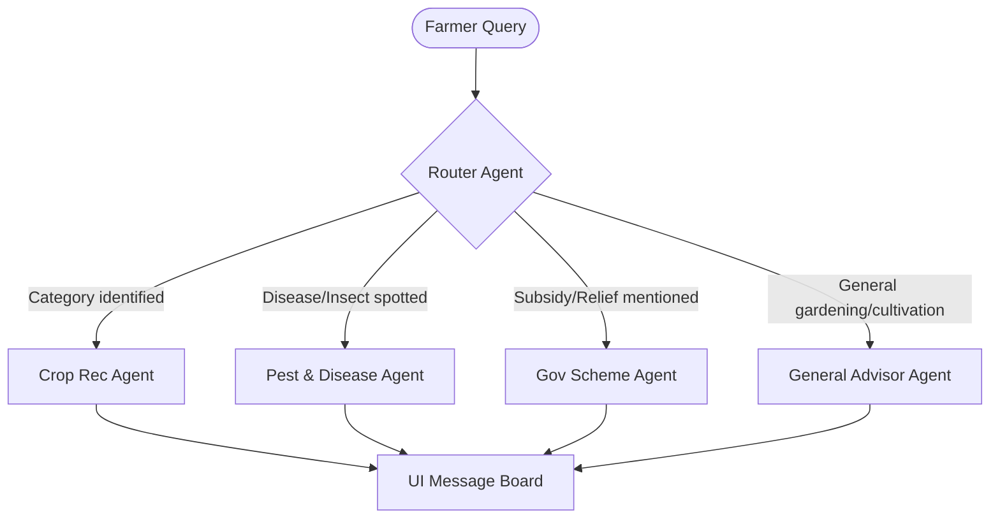

# KhetiMitra - AI Farmer Assistance Agent

KhetiMitra is an AI-powered agricultural helper built under the "Agents for Good" domain. Designed for small-to-medium scale farmers, agricultural students, and new learners, KhetiMitra uses a modular multi-agent system to handle diverse inquiries.

---

## 1. Project Specification & Architecture

The application implements a multi-agent routing workflow:



### Components
1. **Router Agent**: Automatically categorizes inquiries and extracts entities (soil, season, symptoms).
2. **Crop Recommendation Agent**: Matches soil traits and planting times to high-yield crops.
3. **Pest & Disease Expert**: Diagnoses issues and provides warnings/treatment options.
4. **Government Schemes Guide**: Explains criteria and steps to apply for subsidies.
5. **General Advisor**: Practical instructions for day-to-day cultivation.

---

## 2. Prompts Catalog

All core prompts are configured in [agents.js](file:///c:/Users/srini/kaggle/capstoneproject/agents.js):
- **Router Agent**: Enforces outputting structured category choices.
- **Crop Advisor**: Requests output broken down by crop names, advantages, and tips.
- **Pest Specialist**: Standardizes diagnosis formatting and prints warnings for critical crop infections.
- **Government Schemes Advisor**: Formats application procedures.
- **General Advisor**: Enforces simple, farmer-friendly vocabulary and low-cost tips.

---

## 3. Web Application & Folder Structure

```
c:\Users\srini\kaggle\capstoneproject/
├── index.html                   # HTML structure and layouts
├── style.css                    # Organic theme custom styles
├── app.js                       # Logic controller
├── agents.js                    # Prompts & multi-agent orchestrator
├── evaluation_framework.md      # Testing matrix and edge cases
└── README.md                    # Project documentation
```

---

## 4. Run & Test Locally

No installation or compilation is required! To run the application:
1. Open [index.html](file:///c:/Users/srini/kaggle/capstoneproject/index.html) directly in any modern browser.
2. Type queries in the input bar or use the **Try asking** suggestion chips.
3. If you want to use live LLM generations, enter your Gemini API Key in the settings sidebar.

---

## 5. Deployment Recommendations

- **Static Hosting**: Since the MVP runs completely in the browser, it can be deployed for free on platforms like **GitHub Pages**, **Vercel**, or **Netlify** by uploading the static files (`index.html`, `style.css`, `app.js`, `agents.js`).
- **Production Integration**: For production deployments where API keys should not be exposed client-side, migrate the code in `agents.js` to an Express/Node.js backend service (e.g., hosted on Render or AWS App Runner) and call it through a secure proxy endpoint.
